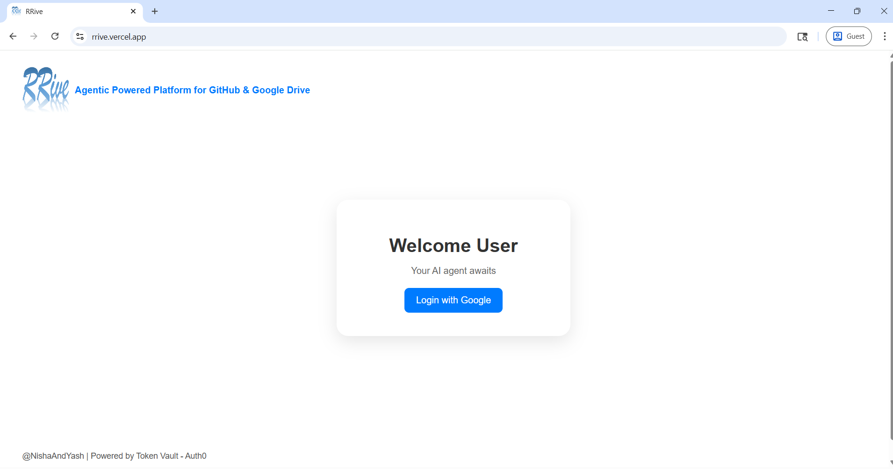
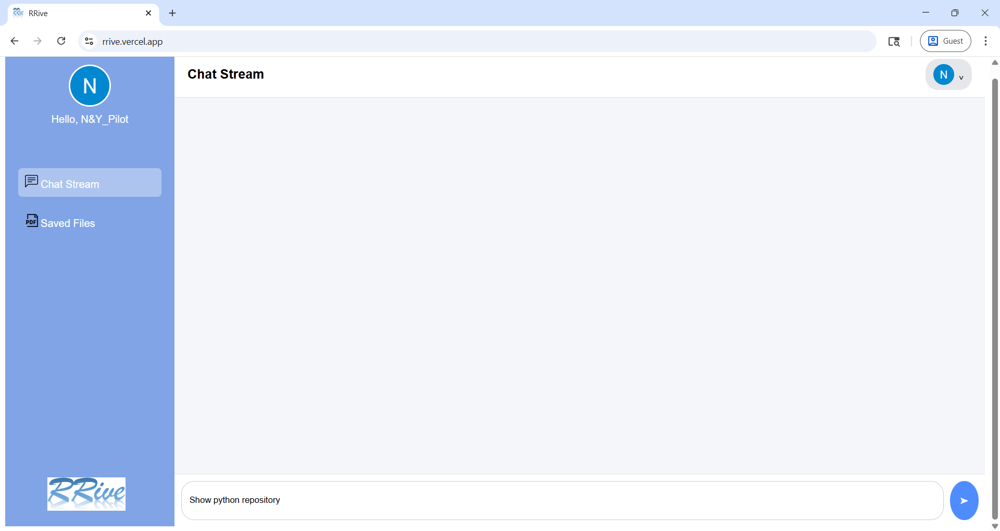
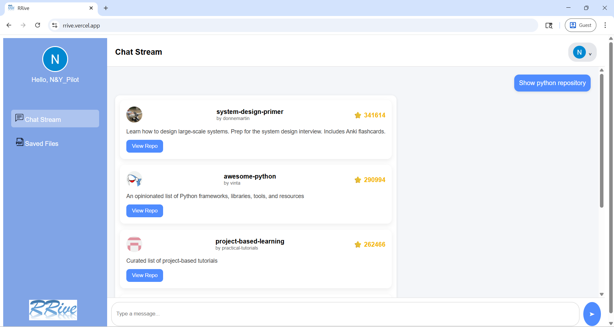
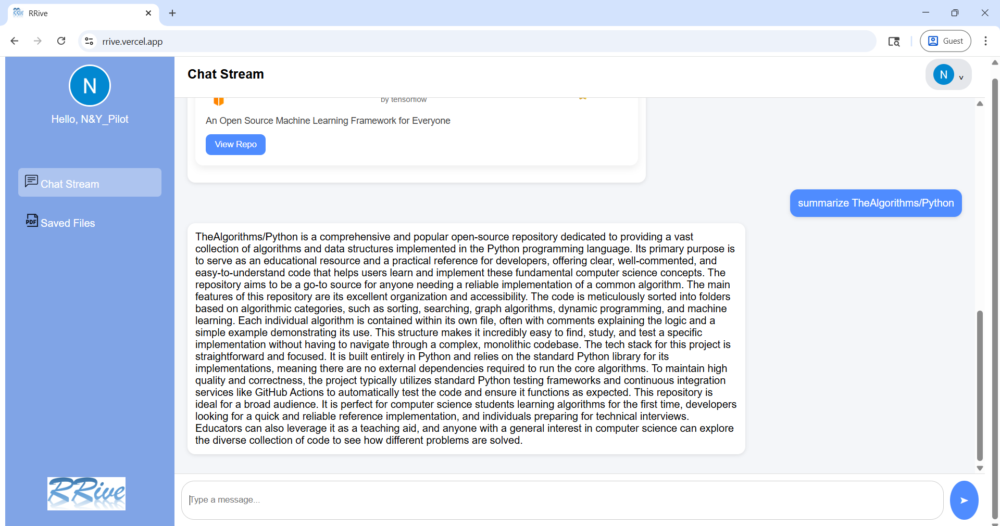
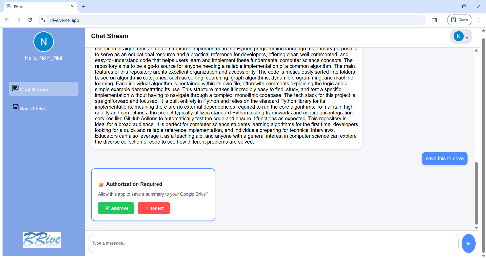
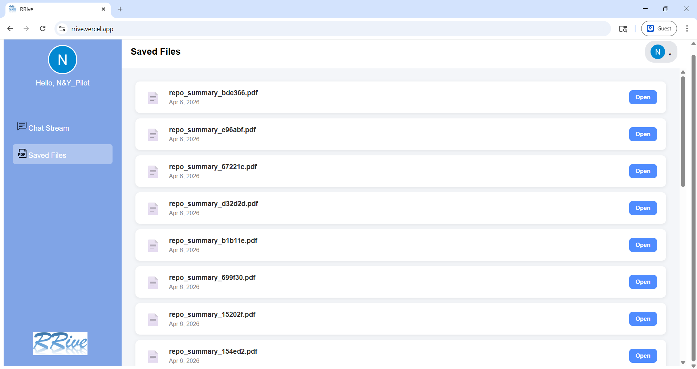
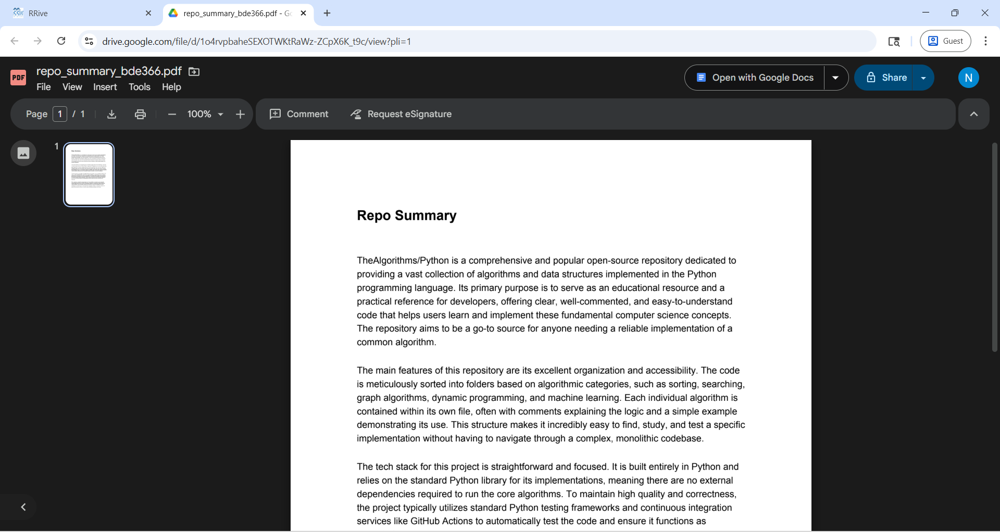
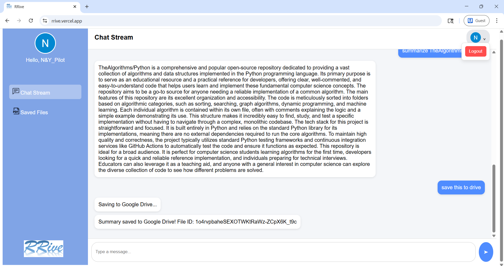

# RRive - Agentic Powered Platform for GitHub and Google Drive

An agentic AI platform that helps users search GitHub repositories, get AI-powered summaries, and saves them directly to Google Drive - all secured with Auth0 Token Vault.

---

## Features

- **Google Login** - Secure authentication via Auth0 with Google OAuth.
- **GitHub Repository Search** - Search and browse top GitHub repositories by topic.
- **AI-Powered Summaries** - Get clean, readable summaries of any GitHub repository using its README.
- **Save to Google Drive** - Save AI-generated summaries as PDFs directly to your Google Drive.
- **Token Vault Integration** - Auth0 Token Vault securely stores and manages Google OAuth tokens.
- **Authorization Flow** - Users can explicitly approve or reject before any Google Drive action takes place.
- **Saved Files Panel** - Browse and open all previously saved PDFs from within the app.
- **Persistent Chat** - Chat history is preserved while switching between the Chat Stream and Saved Files panel.
- **Auto-scroll** - Chat automatically scrolls to the latest message.

---

## Tech Stack

### Frontend
| Technology | Purpose |
|---|---|
| React 19 | UI framework |
| Vite | Build tool and dev server |
| react-icons | Icon components |
| Fetch API | HTTP requests to backend |

### Backend
| Technology | Purpose |
|---|---|
| FastAPI | REST API framework |
| Uvicorn | ASGI server |
| Authlib | Auth0 OAuth integration |
| Starlette Sessions | Server-side session management |
| Requests | HTTP client for external APIs |
| ReportLab | PDF generation |
| python-dotenv | Environment variable management |

### External Services
| Service | Purpose |
|---|---|
| Auth0 | Authentication, session management, Token Vault |
| Google OAuth | User login and Drive access |
| Google Drive API | File upload and retrieval |
| GitHub API | Repository search and README fetching |
| Sarvam AI | LLM for generating summaries and responses |

---

## Project Structure

```
Project/
├── .gitignore
├── backend/
│   ├── .env                           # Environment variables (never commit)
│   ├── .env.example                   # Template for Creating .env                                                
|   ├── .gitignore                     # Ignores non essential files in upload to git
│   ├── .python-version                # Required python version
│   ├── render.yaml                    # Required for Render Deployment
│   ├── requirements.txt               # Required python libraries
│   └── app/
│       ├── main.py                    # FastAPI app entry point
│       ├── config.py                  # Centralized environment config
│       ├── agent/
│       │   ├── agent_controller.py    # Main agent logic and routing
│       │   ├── memory.py              # In-memory chat and session store
│       │   ├── planner.py             # LLM-based action planner
│       │   └── tools.py               # Tool execution (GitHub, Drive)
│       ├── api/
│       │   └── routes.py              # API route definitions
│       ├── auth/
│       │   ├── auth_routes.py         # Auth0 login/logout/callback routes
│       │   ├── auth0_handler.py       # Session-based auth dependency
│       │   ├── connected_accounts.py  # Auth0 Connected Accounts flow
│       │   └── token_vault.py         # Token Vault exchange logic
│       ├── models/
│       │   └── schemas.py             # Pydantic request models
│       └── services/
│           ├── ai_service.py          # Sarvam AI integration
│           ├── drive_service.py       # Google Drive upload
│           ├── github_service.py      # GitHub API search and README
│           └── pdf_service.py         # PDF creation with ReportLab
|── frontend/
|    ├── .gitignore                    # Ignores non essential files in upload to git
|    ├── .env.production               # Backend URL stored, required for Vercel deployment
|    ├── package.json                  # Frontend dependencies
|    ├── package-lock.json             # Auto-generated dependency lockfile
|    ├── vite.config.js                # Vite build configuration
|    ├── eslint.config.js              # ESLint configuration
|    ├── index.html                    # HTML entry point
|    └── src/
|        ├── main.jsx                  # React entry point
|        ├── App.jsx                   # Root component with auth routing
|        ├── assets/
|        │   └── logo.png              # App logo
|        ├── components/
|        │   ├── ChatBox.jsx           # Chat interface with auth approval UI
|        │   ├── Dashboard.jsx         # Main dashboard with sidebar
|        │   ├── LoginButton.jsx       # Login page
|        │   ├── RepoCard.jsx          # Single repository card
|        │   └── RepoList.jsx          # List of repository cards
|        ├── context/
|        │   └── AuthContext.jsx       # Global auth state and Google connect flow
|        └── services/
|            ├── api.js                # Protected data fetching
|            └── chatApi.js            # Chat, save, and Drive file APIs
|__ Screenshots/
     ├── Login_Page.png                    
     ├── Chat_Panel.png               
     ├── Repo_Card.png                  
     ├── AI_Summary_in_Chat.png             
     ├── Authorization_Required_Card.png                
     ├── Saved_Files_Panel.png 
     ├── PDF_in_Google_Drive.png              
     └── Logout_Page.png  

```

---
   
## Prerequisites

Before setting up, make sure you have:

- **Python 3.11.4**
- **Node.js LTS** (v24.14.0)
- An **Auth0 account** - [auth0.com](https://auth0.com)
- A **Google Cloud Console** project with OAuth credentials
- A **Sarvam AI** API key - [sarvam.ai](https://sarvam.ai)
- A **GitHub account** (optional - for higher API rate limits)

---

## Auth0 Setup

### 1. Create a Regular Web Application
- Go to **Auth0 Dashboard → Applications → Create Application**
- Choose **Regular Web Application**
- Note the following from the **Settings** tab:
  - **Domain** (e.g. `your-tenant.us.auth0.com`) → goes into `AUTH0_DOMAIN`
  - **Client ID** → goes into `AUTH0_CLIENT_ID`
  - **Client Secret** → goes into `AUTH0_CLIENT_SECRET`

### 2. Create and Configure Your Custom API
- Go to **Applications → APIs → Create API**
- Give it a name and set an identifier (e.g. `https://your-api-name`) — this becomes your `AUTH0_AUDIENCE`
- Click **Create**
- Click on the newly created API and go to the **Settings** tab:
  - Under **RBAC Settings**:
    - Enable **RBAC**
    - Enable **Add Permissions in the Access Token**
  - Under **Application Access Policy**:
    - In both **User Access** and **Client Access** dropdowns → select **Allow via Client-Grant**
  - Click **Save**
- Go to the **Permissions** tab on the same page:
  - Click **Add Permission**
  - Set **Permission Name** to `read:data`
  - Set **Description** to something like `Read access to data`
  - Click **Add**
- Go to the **Application Access** tab on the same page:
  - Find your application name and click **Edit**
  - In the **User Access** panel:
    - Under **Authorization** → select **Authorized**
    - Select the permission **read:data** that you created earlier
  - Click **Save**
- Note the **API Audience** (the identifier you set, e.g. `https://your-api-name`) → goes into `AUTH0_AUDIENCE`

### 3. Get Management API Token
- Go to **Applications → APIs → Auth0 Management API → Test tab**
- Copy the token from the audience key-value pair → goes into `AUTH0_MGMT_API_TOKEN`
- **Note:** It is only used for the debug function during development and is **not required in production**.

### 4. Configure Application Settings
- **Allowed Callback URLs:**
  ```
  http://localhost:8000/auth/callback, http://localhost:8000/auth/connected-accounts/callback
  ```
- **Allowed Logout URLs:** `http://localhost:5173`
- **Allowed Web Origins:** `http://localhost:5173`

### 5. Enable Grant Types in Application Settings
- Go to **Advanced Settings → Grant Types**
- Enable: **Authorization Code**, **Refresh Token**, **Token Vault**

### 6. Configure Refresh Tokens
- Enable **Idle Refresh Token Lifetime** → `2591000` seconds (around 30 days)
- Enable **Maximum Refresh Token Lifetime** → `2592000` seconds (30 days)
- Keep **Refresh Token Rotation** → OFF → **At the Right Lower Corner, Click** → **Save**

### 7. Enable Google Drive API in Google Cloud Console
- Go to [console.cloud.google.com](https://console.cloud.google.com)
- Navigate to **APIs & Services → Library**
- Search for **Google Drive API**
- Click on it and click **Enable**

### 8. Set Up Google Social Connection in Auth0
- Go to **Authentication → Social → Google**
- Add your Google OAuth **Client ID** and **Client Secret** (from Google Cloud Console)
- Under **Purpose** → enable both **Authentication** and **Connected Accounts for Token Vault**
- Under **Permissions** → enable:
  - `offline_access`
  - `https://www.googleapis.com/auth/drive.file`
- Under **Additional Scopes** → add the following scopes one by one:
  - openid profile email https://www.googleapis.com/auth/drive.file
  - Save the connection

### 9. Activate My Account API
- Go to **Applications → APIs → Auth0 My Account API → Activate**
- Go to **Application Access** → find your app → click on edit → click on User Acess → click on Authorization
- Select **All** Connected Accounts scopes - Click on **Save**

### 10. Enable MRRT
- Go to **Applications → Your App → Multi-Resource Refresh Token**
- Toggle ON **My Account API**

### 11. Authorize Management API
- Go to **Applications → APIs → Auth0 Management API → Machine to Machine Applications**
- Find your app → Authorize
- Add scopes: `read:users`, `read:user_idp_tokens`
- Click on save

---

## Google Cloud Setup

1. Go to [console.cloud.google.com](https://console.cloud.google.com)
2. Create a new project
3. Go to **APIs & Services → OAuth consent screen**
   - Set Publishing Status to **In Production** (free, no verification needed for `drive.file` scope)
4. Go to **Credentials → Create OAuth Client ID**
   - Type: **Web Application**
   - Authorize JavaScript Origins - add you Frontend URL
   - Authorized redirect URIs: add your Auth0 callback URL
   - Click on Save
5. Copy the **Client ID** and **Client Secret** → paste into Auth0 Google Social Connection

---

## Environment Variables

### Backend — `backend/.env`

```env
# Auth0
AUTH0_DOMAIN=your-tenant.us.auth0.com
AUTH0_AUDIENCE=your-api-audience
AUTH0_CLIENT_ID=your-regular-web-app-client-id
AUTH0_CLIENT_SECRET=your-regular-web-app-client-secret
AUTH0_MGMT_API_TOKEN=your-management-api-token

# URLs
FRONTEND_URL=http://localhost:5173
BACKEND_URL=http://localhost:8000

# Session
APP_SECRET_KEY=generate-a-long-random-secret-key

# AI
SARVAM_API_KEY=your-sarvam-api-key

# GitHub (optional - increases rate limit from 10 to 5000 req/min)
GITHUB_TOKEN=your-github-personal-access-token
```

> To generate `APP_SECRET_KEY`, run: `python -c "import secrets; print(secrets.token_hex(32))"`

---

## Installation & Setup

### Backend

```bash
# Navigate to backend directory
cd backend

# Create and activate virtual environment
python -m venv venv

# On Windows:
venv\Scripts\activate

# On Mac/Linux:
source venv/bin/activate

# Install dependencies
pip install -r requirements.txt

# Create .env file and fill in your values
cp .env.example .env
```

### Frontend

```bash
# Navigate to frontend directory
cd frontend

# Install dependencies
npm install
```

---

## Running the Application

### Start Backend
```bash
cd backend
uvicorn app.main:app --reload
```
Backend runs at: `http://localhost:8000`

### Start Frontend
```bash
cd frontend
npm run dev
```
Frontend runs at: `http://localhost:5173`

---

## How to Use

1. Open `http://localhost:5173` in your browser.
2. Click **Login with Google** - you will be redirected to Google login.
3. Select your Google account and complete the login.
4. You will be redirected back to the dashboard briefly.
5. The app will then automatically redirect you to a **Google consent screen** - this is Auth0 Token Vault connecting your Google Drive.
6. Click **Allow** to grant Google Drive access.
7. You are now in a dashboard with full access to all features!

> **Note:** The two-step redirect (login → dashboard → Google consent) is intentional. The first step logs you in via Auth0, and the second step connects your Google Drive through Auth0 Token Vault for secure file operations.

### Chat Commands

| What you type | What happens |
|---|---|
| `Show me Python repository` | Searches GitHub for top Python repos |
| `Summarize facebook/react` | Fetches README and generates an AI summary |
| `What is machine learning?` | AI answers directly in chat |
| `Save this to drive` | Shows Authorization Required prompt |
| Click **Approve** | Saves the last summary as a PDF to Google Drive |
| `Show more` | Loads next page of search results |

### Saved Files
- Click **Saved Files** in the sidebar to view all PDFs saved to your Drive.
- Click **Open** to open any file directly in Google Drive.

---

## API Endpoints

| Method | Endpoint | Description |
|---|---|---|
| GET | `/auth/login` | Start Google login flow |
| GET | `/auth/callback` | Auth0 login callback |
| GET | `/auth/me` | Get current user from session |
| GET | `/auth/logout` | Logout and clear session |
| GET | `/auth/connect-google` | Initiate Token Vault Connected Accounts flow |
| GET | `/auth/connected-accounts/callback` | Complete Connected Accounts flow |
| POST | `/chat` | Send a message to the AI agent |
| POST | `/save-to-drive` | Save last summary to Google Drive |
| GET | `/drive-files` | Fetch saved PDFs from Google Drive |
| GET | `/protected` | Test protected route |

---

## Security Notes

- All authentication is handled **server-side** - no tokens are ever sent to the browser.
- Google OAuth tokens are stored securely in **Auth0 Token Vault**.
- Sessions are encrypted using `APP_SECRET_KEY`.
- The frontend only communicates with your own FastAPI backend.
- Never commit `.env` files to version control.

---

## Screenshots
> A quick look at the major features of the application.


| Login Page | Chat Panel |
|---|---|
|  |  |

| Repo Card | AI Summary in Chat |
|---|---|
|  |  |

| Authorization Required | Saved Files Panel |
|---|---|
|  |  |

| PDF in Google Drive | Logout Page |
|---|---|
|  |  |

---

## Known Limitations

- Chat history is stored **in-memory** - it resets when the server restarts.
- Memory is limited to the **last 10 messages** per user.
- GitHub API has a rate limit of **10 requests/minute** without a token (5000/min with token).
- Token Vault requires users to log in with **Google** social connection.

---

## Built With

- [Auth0](https://auth0.com) - Authentication and Token Vault
- [Sarvam AI](https://sarvam.ai) - Large Language Model
- [FastAPI](https://fastapi.tiangolo.com) - Backend framework
- [React](https://react.dev) - Frontend framework
- [Google Drive API](https://developers.google.com/drive) - File storage
- [GitHub API](https://docs.github.com/en/rest) - Repository data
- [Render](https://render.com) - Hosted Backend on Render
- [Vercel](https://vercel.com) - Hosted Frontend on Vercel

---

---

## For Demo
- [Youtube](https://www.youtube.com/watch?v=nBXvFFhoSHg) - Demo Video
- [Vercel App](https://rrive.vercel.app) - Application Domain

---

---

## Important Note for Hosted Application on Vercel
- It takes around 1 minute to load the application, due to inactivity of server.
- When you newly login, you'll face a **double login**, and the Saved Files Panel will display a message - **No Saved Files Yet**.

---
## Authors

**Nisha Shivarkar** - Frontend Development
- Github: [Nisha-S-S](https://github.com/Nisha-S-S)

**Yash Shivarkar** - Backend Development
- Github: [Yash-S-S](https://github.com/Yash-S-S)

---

*Powered by Token Vault - Auth0*
